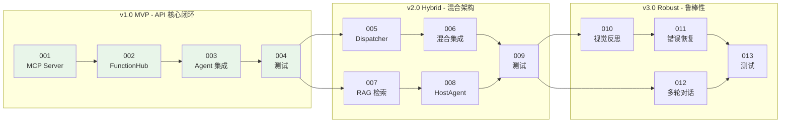

# CATIA VLA-Hybrid 开发计划

> **Development Roadmap for Visual-Language-Action Hybrid Agent**  
> 版本迭代开发任务书

---

## 📋 版本规划概览

| 版本 | 目标 | 预计周期 | 状态 |
|-----|------|---------|------|
| **v1.0 MVP** | API 核心闭环 | 2 周 | 🟡 进行中 |
| **v2.0 Hybrid** | 混合架构集成 | 3 周 | ⏳ 待开始 |
| **v3.0 Robust** | 鲁棒性增强 | 2 周 | ⏳ 待开始 |

---

### 🔗 任务依赖关系图



**说明**:
- 绿色节点: v1.0 MVP 核心任务（当前阶段）
- 箭头: 任务依赖关系（A → B 表示 B 依赖 A 完成）

---

## 🎯 v1.0 MVP - API 核心闭环

**目标**: 跑通 "自然语言 → LLM → MCP → pycatia → CATIA" 的最小闭环

### TASK-001: 创建 CATIA MCP Server

| 属性 | 值 |
|-----|-----|
| **任务名称** | 封装 pycatia 指令为 MCP Server |
| **状态** | 🟡 待开始 |
| **优先级** | P0 |
| **依赖** | 无 |

#### 验收标准 (Definition of Done)

- [ ] MCP Server 能够独立启动，无报错
- [ ] 支持至少 5 个核心几何操作：`create_rectangle`, `create_pad`, `create_extrude`, `create_fillet`, `create_plane`
- [ ] 每个工具有完整的 JSON Schema 描述
- [ ] 通过 MCP Inspector 工具验证接口可调用
- [ ] 编写单元测试，覆盖率 > 80%

#### 🧪 快速验证

```bash
# 1. 验证 MCP Server 能独立启动
python mcp_servers/catia_mcp_server.py

# 2. 验证工具列表（需要 MCP Inspector）
npx @anthropic/mcp-inspector python mcp_servers/catia_mcp_server.py

# 3. 运行单元测试
pytest test/unittest/test_catia_mcp.py -v
```

#### 🔴 AI 编程助手提示词

```markdown
## 任务背景

我需要你帮我创建一个基于 MCP (Model Context Protocol) 的 CATIA 操作服务器。这个服务器将封装现有的 pycatia 几何建模类，使其可以被 LLM 智能体调用。

## 代码位置

- 输入: `applications/Catia_Optimzation/utiles/instruction.py`
- 输入: `applications/Catia_Optimzation/mcp/instruction_mcp.py`
- 输出: `mcp_servers/catia_mcp_server.py` (新建)

## 技术要求

1. 使用 `mcp.server.fastmcp.FastMCP` 创建 MCP Server
2. 每个工具函数必须有：
   - 清晰的 `@mcp.tool(description="...")` 装饰器
   - 使用 `pydantic.Field` 定义参数
   - 返回 JSON 字符串格式的执行结果
3. 必须处理 CATIA 连接的单例模式（避免重复连接）
4. 实现以下核心工具：

```python
# 需要实现的工具函数签名：
@mcp.tool(description="Create a new CATIA Part document")
def create_new_part(visible: bool = True) -> str:
    """创建新的 Part 文档，返回 Part 名称"""
    
@mcp.tool(description="Create a rectangle sketch on a plane")
def create_rectangle(
    support_plane: str,  # "PlaneXY", "PlaneYZ", "PlaneZX"
    length: float,
    width: float,
    body_name: str = "Geometry",
    name: str = None
) -> str:
    """创建矩形草图"""

@mcp.tool(description="Create a pad (solid extrusion) from a sketch")
def create_pad(
    profile_name: str,  # 草图名称
    height: float,
    name: str = None
) -> str:
    """从草图创建凸台"""

@mcp.tool(description="Create a surface extrusion from a profile")
def create_extrude(
    profile_name: str,
    direction: str,  # "PlaneXY", "XAxis", "YAxis", "ZAxis"
    length1: float,
    length2: float = 0.0,
    body_name: str = "Geometry",
    name: str = None
) -> str:
    """创建拉伸曲面"""

@mcp.tool(description="Create a fillet between two surfaces")
def create_fillet(
    first_surface: str,
    second_surface: str,
    radius: float,
    body_name: str = "Geometry",
    name: str = None
) -> str:
    """创建倒角"""
```

## 依赖处理

- `pycatia` 需要 CATIA 正在运行才能连接
- 使用延迟连接模式：首次调用时才建立连接
- 连接失败时返回友好的错误信息

## 参考代码

参考 `applications/Catia_Optimzation/mcp/instruction_mcp.py` 中的现有实现，但需要：
1. 移除 `part: Part` 参数（使用全局单例）
2. 添加 `create_new_part` 用于初始化
3. 改进错误处理和返回格式

## 输出格式

请输出完整的 `mcp_servers/catia_mcp_server.py` 文件内容。
```

---

### TASK-002: 创建 CATIA API FunctionHub

| 属性 | 值 |
|-----|-----|
| **任务名称** | 封装 MCP Client 为 OxyGent FunctionHub |
| **状态** | 🟡 待开始 |
| **优先级** | P0 |
| **依赖** | TASK-001 |

#### 验收标准 (Definition of Done)

- [ ] 创建 `function_hubs/catia_api_tools.py`
- [ ] 包装 pycatia 调用为 FunctionHub 工具
- [ ] 可以通过 OxyGent ReActAgent 调用
- [ ] 编写集成测试

#### 🧪 快速验证

```bash
# 1. 验证模块导入
python -c "from function_hubs.catia_api_tools import catia_api_tools; print('工具列表:', list(catia_api_tools.func_dict.keys()))"

# 2. 验证工具函数签名
python -c "from function_hubs.catia_api_tools import create_new_part; help(create_new_part)"

# 3. 运行单元测试
pytest test/unittest/test_catia_api_tools.py -v
```

#### 🔴 AI 编程助手提示词

```markdown
## 任务背景

创建 OxyGent FunctionHub，包装 CATIA API 操作。

## 代码位置

- 参考文件：`function_hubs/catia_tools.py` (现有的视觉工具 Hub)
- 参考文件：`oxygent/oxy/function_tools/function_hub.py` (FunctionHub 基类)
- 输出文件：`function_hubs/catia_api_tools.py` (新建)

## 技术要求

1. 使用 `FunctionHub` 模式注册工具
2. 每个工具函数：
   - 使用 `@catia_api_tools.tool(description="...")` 装饰器
   - 参数使用 `pydantic.Field` 定义
   - 返回 JSON 字符串
3. 内部调用 MCP Client 或直接调用 pycatia

## 实现方式选择

**方案 A：直接调用 pycatia (推荐用于单进程)**
```python
from oxygent.oxy import FunctionHub
from pydantic import Field

catia_api_tools = FunctionHub(name="catia_api_tools", desc="CATIA 参数化建模 API 工具集")

@catia_api_tools.tool(description="创建新的 CATIA Part 文档")
def create_new_part(visible: bool = Field(True, description="是否显示 CATIA 窗口")) -> str:
    from pycatia import catia
    caa = catia()
    doc = caa.documents.add("Part")
    return json.dumps({"success": True, "part_name": doc.part.name})
```

**方案 B：通过 MCP Client 调用 (推荐用于进程隔离)**
```python
# 使用 StdioMCPClient 调用外部 MCP Server
# 参考 examples/banks/demo_bank_react_agent_autonomy_by_mcp.py
```

## 需要实现的工具

1. `create_new_part` - 创建新 Part
2. `create_rectangle_sketch` - 创建矩形草图
3. `create_pad` - 创建凸台
4. `create_extrude` - 创建拉伸
5. `create_fillet` - 创建倒角
6. `get_part_info` - 获取当前 Part 信息
7. `save_part` - 保存 Part

## 输出格式

请输出完整的 `function_hubs/catia_api_tools.py` 文件内容，采用方案 A（直接调用 pycatia）。
```

---

### TASK-003: 实现基础 ReActAgent 集成

| 属性 | 值 |
|-----|-----|
| **任务名称** | 创建 CATIA ReActAgent 并测试闭环 |
| **状态** | 🟡 待开始 |
| **优先级** | P0 |
| **依赖** | TASK-002 |

#### 验收标准 (Definition of Done)

- [ ] 创建 `applications/catia_vla/main_api_agent.py`
- [ ] Agent 能够理解 "创建一个 100x100x100 的立方体" 并执行
- [ ] Agent 能够理解 "创建一个 50mm 半径的球体" 并执行
- [ ] 完整的执行日志记录
- [ ] 演示视频或 GIF

#### 🧪 快速验证

```bash
# 1. 验证模块导入
python -c "from applications.catia_vla.main_api_agent import oxy_space; print('配置项:', len(oxy_space))"

# 2. Dry-run 测试（不启动 Web 服务）
python applications/catia_vla/main_api_agent.py --dry-run

# 3. 启动完整服务
python applications/catia_vla/main_api_agent.py
```

#### 🔴 AI 编程助手提示词

```markdown
## 任务背景

我需要创建一个基于 OxyGent ReActAgent 的 CATIA 自动化智能体，能够理解自然语言指令并调用 API 工具执行几何建模操作。

## 代码位置

- 参考: `examples/agents/demo_react_agent.py`
- 参考: `applications/catia_vla/main_integrated.py`
- 输出: `applications/catia_vla/main_api_agent.py` (新建)

## 技术要求

1. 使用 `oxy.ReActAgent` 作为智能体基类
2. 注册 `catia_api_tools` FunctionHub
3. 配置合适的系统 Prompt
4. 支持 Web UI 交互

## 系统 Prompt 设计

```python
CATIA_AGENT_PROMPT = """
你是一个专业的 CATIA 3D 建模助手。你可以通过调用工具来帮助用户完成各种建模任务。

## 可用工具

1. `create_new_part` - 创建新的 Part 文档
2. `create_rectangle_sketch` - 在指定平面上创建矩形草图
3. `create_pad` - 从草图创建凸台（实体拉伸）
4. `create_extrude` - 创建曲面拉伸
5. `create_fillet` - 创建倒角

## 工作流程

1. 首先调用 `create_new_part` 创建文档
2. 然后根据用户需求创建几何体
3. 操作完成后告知用户结果

## 注意事项

- 坐标系：CATIA 使用毫米作为默认单位
- 平面命名：PlaneXY (水平), PlaneYZ (正视), PlaneZX (侧视)
- 草图必须先创建才能用于凸台或拉伸

## 示例

用户: "创建一个 100x100x100 的立方体"
思考: 需要先创建 Part，然后创建 100x100 的矩形草图，最后拉伸 100mm
步骤:
1. create_new_part()
2. create_rectangle_sketch(support_plane="PlaneXY", length=100, width=100, name="Base_Square")
3. create_pad(profile_name="Base_Square", height=100, name="Cube")
"""
```

## 代码结构

```python
import asyncio
import os
from oxygent import MAS, oxy
from function_hubs import catia_api_tools

CATIA_AGENT_PROMPT = "..."  # 上面的 Prompt

oxy_space = [
    oxy.HttpLLM(
        name="default_llm",
        api_key=os.getenv("DEFAULT_LLM_API_KEY"),
        base_url=os.getenv("DEFAULT_LLM_BASE_URL"),
        model_name=os.getenv("DEFAULT_LLM_MODEL_NAME"),
    ),
    catia_api_tools,
    oxy.ReActAgent(
        name="catia_agent",
        llm_model="default_llm",
        tools=["catia_api_tools"],
        prompt=CATIA_AGENT_PROMPT,
        max_react_rounds=10,
    ),
]

async def main():
    async with MAS(oxy_space=oxy_space) as mas:
        await mas.start_web_service(
            first_query="创建一个 100x100x100 的立方体"
        )

if __name__ == "__main__":
    asyncio.run(main())
```

## 测试用例

1. "创建一个 100x100x100 的立方体"
2. "创建一个 200x100x50 的长方体"
3. "在 YZ 平面上创建一个 150x80 的矩形草图"

## 输出格式

请输出完整的 `applications/catia_vla/main_api_agent.py` 文件内容。
```

---

### TASK-004: 编写 v1.0 集成测试

| 属性 | 值 |
|-----|-----|
| **任务名称** | 创建 v1.0 端到端测试套件 |
| **状态** | 🟡 待开始 |
| **优先级** | P1 |
| **依赖** | TASK-003 |

#### 验收标准 (Definition of Done)

- [ ] 创建 `test/integration/test_catia_api_v1.py`
- [ ] 测试覆盖所有 5 个核心工具
- [ ] 测试 Agent 端到端执行
- [ ] CI/CD 集成配置

#### 🧪 快速验证

```bash
# 1. 运行所有 v1.0 测试
pytest test/integration/test_catia_api_v1.py -v

# 2. 仅运行 Mock 测试（无需 CATIA）
pytest test/integration/test_catia_api_v1.py -v -m "not catia_required"

# 3. 生成覆盖率报告
pytest test/integration/test_catia_api_v1.py --cov=function_hubs.catia_api_tools --cov-report=html
```

#### 🔴 AI 编程助手提示词

```markdown
## 任务背景

为 CATIA VLA v1.0 创建完整的集成测试套件。

## 代码位置

- 输出: `test/integration/test_catia_api_v1.py` (新建)

## 技术要求

1. 使用 `pytest` + `pytest-asyncio`
2. Mock CATIA 连接
3. 标记 `@pytest.mark.catia_required`

## 测试类

- `TestCatiaApiTools`: 单元测试
- `TestCatiaIntegration`: 集成测试
- `TestAgentE2E`: 端到端测试

## 输出

完整的测试文件
```

---

## 🔄 v2.0 Hybrid - 混合架构集成

**目标**: 引入视觉模块，实现 "API 建模 + 视觉点击" 的混合调用

### TASK-005: 实现 Unified Dispatcher

| 属性 | 值 |
|-----|-----|
| **任务名称** | 创建混合驱动决策调度器 |
| **状态** | ⏳ 待开始 |
| **优先级** | P0 |
| **依赖** | TASK-004 |

#### 验收标准 (Definition of Done)

- [ ] 创建 `applications/catia_vla/agent/dispatcher.py`
- [ ] 实现操作类型到执行模态的映射
- [ ] 支持动态模态切换
- [ ] 支持 API 失败后自动降级到视觉模态

#### 🧪 快速验证

```bash
# 1. 验证模块导入
python -c "from applications.catia_vla.agent.dispatcher import UnifiedDispatcher, ExecutionModality; print('OK')"

# 2. 验证模态选择逻辑
python -c "
from applications.catia_vla.agent.dispatcher import UnifiedDispatcher
d = UnifiedDispatcher({}, {})
print('create_pad:', d.get_modality('create_pad'))
print('click_toolbar:', d.get_modality('click_toolbar'))
"

# 3. 运行单元测试
pytest test/unittest/test_dispatcher.py -v
```

#### 🔴 AI 编程助手提示词

```markdown
## 任务背景

创建统一调度器，根据操作类型自动选择执行模态。

## 代码位置

- 输出: `applications/catia_vla/agent/dispatcher.py` (新建)

## 技术要求

1. `ExecutionModality` 枚举: API, VISION, HYBRID
2. `ExecutionResult` 数据类
3. `UnifiedDispatcher` 类: 操作映射 + 失败降级

## 输出

```python
from enum import Enum
from typing import Dict, Callable, Any, Optional
from dataclasses import dataclass
import logging

logger = logging.getLogger(__name__)

class ExecutionModality(Enum):
    API = "api"
    VISION = "vision"
    HYBRID = "hybrid"

@dataclass
class ExecutionResult:
    success: bool
    modality: ExecutionModality
    output: Any
    error: Optional[str] = None
    fallback_used: bool = False

class UnifiedDispatcher:
    """
    混合驱动决策调度器
    
    职责：
    1. 根据操作类型选择执行模态
    2. 管理 API 和视觉工具的调用
    3. 处理失败降级逻辑
    """
    
    # API 支持的操作类型
    API_OPERATIONS = {
        "create_part", "create_sketch", "create_rectangle",
        "create_pad", "create_extrude", "create_fillet",
        "create_chamfer", "create_plane", "create_point",
        "boolean_join", "boolean_split", "mirror",
        "set_parameter", "get_parameter", "save_part"
    }
    
    # 必须使用视觉的操作
    VISION_ONLY_OPERATIONS = {
        "click_toolbar", "click_menu", "handle_dialog",
        "select_tree_node", "drag_drop", "custom_macro"
    }
    
    def __init__(
        self,
        api_tools: Dict[str, Callable],
        vision_tools: Dict[str, Callable],
        enable_fallback: bool = True,
        max_retries: int = 2
    ):
        self.api_tools = api_tools
        self.vision_tools = vision_tools
        self.enable_fallback = enable_fallback
        self.max_retries = max_retries
    
    def get_modality(self, operation: str) -> ExecutionModality:
        """根据操作类型返回执行模态"""
        if operation in self.API_OPERATIONS:
            return ExecutionModality.API
        elif operation in self.VISION_ONLY_OPERATIONS:
            return ExecutionModality.VISION
        else:
            return ExecutionModality.HYBRID
    
    async def execute(
        self,
        operation: str,
        params: Dict[str, Any],
        force_modality: Optional[ExecutionModality] = None
    ) -> ExecutionResult:
        """执行操作，自动选择模态"""
        modality = force_modality or self.get_modality(operation)
        
        if modality == ExecutionModality.API:
            result = await self._execute_api(operation, params)
            if not result.success and self.enable_fallback:
                logger.warning(f"API 执行失败，降级到视觉模态: {result.error}")
                result = await self._execute_vision(operation, params)
                result.fallback_used = True
            return result
        
        elif modality == ExecutionModality.VISION:
            return await self._execute_vision(operation, params)
        
        else:  # HYBRID
            # 尝试 API，失败则视觉
            result = await self._execute_api(operation, params)
            if not result.success:
                result = await self._execute_vision(operation, params)
                result.fallback_used = True
            return result
    
    async def _execute_api(self, operation: str, params: Dict) -> ExecutionResult:
        """执行 API 模态操作"""
        # 实现细节...
    
    async def _execute_vision(self, operation: str, params: Dict) -> ExecutionResult:
        """执行视觉模态操作"""
        # 实现细节...
```

## 输出格式

请输出完整的 `dispatcher.py` 文件，包含：
1. 完整的类实现
2. 辅助函数
3. 使用示例
```

---

### TASK-006: 集成视觉工具与 API 工具

| 属性 | 值 |
|-----|-----|
| **任务名称** | 将视觉工具和 API 工具统一注册 |
| **状态** | ⏳ 待开始 |
| **优先级** | P0 |
| **依赖** | TASK-005 |

#### 验收标准 (Definition of Done)

- [ ] 创建 `applications/catia_vla/main_hybrid_agent.py`
- [ ] 同时注册 `catia_tools` 和 `catia_api_tools`
- [ ] Agent 能够根据任务自动选择工具
- [ ] 测试混合调用场景

#### 🧪 快速验证

```bash
# 1. 验证模块导入
python -c "from applications.catia_vla.main_hybrid_agent import oxy_space; print('配置项:', len(oxy_space))"

# 2. Dry-run 测试
python applications/catia_vla/main_hybrid_agent.py --dry-run

# 3. 启动完整服务
python applications/catia_vla/main_hybrid_agent.py
```

#### 🔴 AI 编程助手提示词

```markdown
## 任务背景

修改主集成文件，同时注册视觉和 API 工具。

## 代码位置

- 输入: `function_hubs/catia_tools.py`
- 输入: `function_hubs/catia_api_tools.py`
- 输出: `applications/catia_vla/main_hybrid_agent.py` (新建)

## 技术要求

1. 注册两个 FunctionHub
2. 设计混合 Prompt
3. 工具选择策略

## 输出

```python
HYBRID_AGENT_PROMPT = """
你是一个专业的 CATIA 3D 建模助手，具有两种操作能力：

## 模态 A: API 操作 (高速精准)
适用于标准几何建模操作：
- create_new_part - 创建新文档
- create_rectangle_sketch - 创建矩形草图
- create_pad - 创建凸台
- create_extrude - 创建拉伸
- create_fillet - 创建倒角

## 模态 B: 视觉操作 (高兼容性)
适用于 GUI 交互操作：
- capture_screen - 截取屏幕
- detect_ui_elements - 识别界面元素
- click_element - 点击指定坐标
- input_text - 输入文本

## 工具选择策略

1. **几何建模** → 优先使用 API 工具
2. **工具栏点击** → 使用视觉工具
3. **对话框处理** → 使用视觉工具
4. **文件操作** → 先尝试 API，失败则视觉

## 工作流程示例

### 示例1: 创建立方体 (纯 API)
用户: "创建一个 100mm 的立方体"
1. create_new_part() → API
2. create_rectangle_sketch(length=100, width=100) → API
3. create_pad(height=100) → API

### 示例2: 点击工具栏 (视觉)
用户: "点击'拉伸'工具"
1. capture_screen() → 获取截图
2. detect_ui_elements() → 识别"拉伸"图标
3. click_element(x, y) → 点击图标

### 示例3: 混合操作
用户: "创建一个立方体并保存"
1. [API] create_new_part()
2. [API] create_rectangle_sketch()
3. [API] create_pad()
4. [视觉] capture_screen()
5. [视觉] detect_ui_elements() → 找到"保存"按钮
6. [视觉] click_element() → 点击保存
"""
```

## 代码结构

```python
import asyncio
import os
from oxygent import MAS, oxy
from function_hubs import catia_tools, catia_api_tools

oxy_space = [
    oxy.HttpLLM(name="default_llm", ...),
    
    # 视觉工具
    catia_tools,
    
    # API 工具
    catia_api_tools,
    
    # 混合智能体
    oxy.ReActAgent(
        name="catia_hybrid_agent",
        llm_model="default_llm",
        tools=["catia_tools", "catia_api_tools"],
        prompt=HYBRID_AGENT_PROMPT,
    ),
]
```

## 输出格式

请输出完整的 `main_hybrid_agent.py` 文件。
```

---

### TASK-007: 实现 RAG 知识检索

| 属性 | 值 |
|-----|-----|
| **任务名称** | 实现 SOP 文档的 RAG 检索 |
| **状态** | ⏳ 待开始 |
| **优先级** | P1 |
| **依赖** | TASK-004 |

#### 验收标准 (Definition of Done)

- [ ] 创建 `applications/catia_vla/knowledge/rag_retriever.py`
- [ ] 使用 ChromaDB 作为向量数据库
- [ ] 支持 Markdown SOP 文档索引
- [ ] 检索结果能够注入到 Agent Prompt

#### 🧪 快速验证

```bash
# 1. 验证模块导入
python -c "from applications.catia_vla.knowledge.rag_retriever import SOPRetriever; print('OK')"

# 2. 测试文档索引
python -c "
from applications.catia_vla.knowledge.rag_retriever import SOPRetriever
r = SOPRetriever()
count = r.index_documents('applications/catia_vla/knowledge/sop_docs')
print(f'索引文档数: {count}')
"

# 3. 测试检索
python -c "
from applications.catia_vla.knowledge.rag_retriever import SOPRetriever
r = SOPRetriever()
results = r.search('创建加强筋')
print(f'检索结果: {len(results)} 条')
"
```

#### 🔴 AI 编程助手提示词

```markdown
## 任务背景

实现 RAG 检索器，从 SOP 文档库检索操作步骤。

## 代码位置

- 参考: `oxygent/oxy/agents/rag_agent.py`
- 输出: `applications/catia_vla/knowledge/rag_retriever.py` (重写)

## 技术要求

1. ChromaDB 向量数据库
2. Markdown 文档分块
3. 相似度检索接口

## 输出

```markdown
# SOP: 创建带加强筋的底座

## 概述
本文档描述如何在 CATIA V5 中创建一个带有加强筋的底座结构。

## 前置条件
- CATIA V5 R21 或更高版本
- Part Design 工作台

## 操作步骤

### 步骤 1: 创建底板
1. 在 XY 平面创建矩形草图
2. 尺寸: 200mm x 150mm
3. 拉伸 10mm 创建底板

### 步骤 2: 创建加强筋
1. 在底板上表面创建草图
2. 绘制加强筋轮廓
3. 使用"肋"命令创建加强筋

### 步骤 3: 添加圆角
1. 选择底板边缘
2. 添加 R5 圆角

## 注意事项
- 加强筋方向应与受力方向垂直
- 圆角半径不宜过大
```

## 实现规范

```python
from typing import List, Dict, Optional
import chromadb
from chromadb.config import Settings
import os
import logging

logger = logging.getLogger(__name__)

class SOPRetriever:
    """
    SOP 文档 RAG 检索器
    """
    
    def __init__(
        self,
        persist_dir: str = "./cache_dir/chroma_db",
        collection_name: str = "catia_sop",
        embedding_model: str = "text-embedding-ada-002"
    ):
        self.client = chromadb.PersistentClient(path=persist_dir)
        self.collection = self.client.get_or_create_collection(
            name=collection_name,
            metadata={"hnsw:space": "cosine"}
        )
        self.embedding_model = embedding_model
    
    def index_documents(self, docs_dir: str) -> int:
        """索引 SOP 文档目录"""
        # 实现：
        # 1. 遍历目录中的 .md 文件
        # 2. 分块处理（按 ## 标题分割）
        # 3. 生成 embeddings
        # 4. 存入 ChromaDB
    
    def search(
        self,
        query: str,
        top_k: int = 3,
        min_score: float = 0.5
    ) -> List[Dict]:
        """检索相关 SOP 片段"""
        # 实现：
        # 1. 生成 query embedding
        # 2. 向量相似度搜索
        # 3. 返回 top_k 结果
    
    def format_context(self, results: List[Dict]) -> str:
        """格式化检索结果为 Prompt 上下文"""
        # 实现：
        # 将检索结果格式化为可读文本

# 使用示例
async def retrieve_sop_for_task(query: str) -> str:
    retriever = SOPRetriever()
    results = retriever.search(query, top_k=3)
    return retriever.format_context(results)
```

## 与 RAGAgent 集成

```python
from oxygent.oxy.agents.rag_agent import RAGAgent

class CATIARAGAgent(RAGAgent):
    def __init__(self, **kwargs):
        super().__init__(
            func_retrieve_knowledge=self._retrieve_sop,
            **kwargs
        )
        self.sop_retriever = SOPRetriever()
    
    async def _retrieve_sop(self, oxy_request) -> str:
        query = oxy_request.get_query()
        return await self.sop_retriever.search(query)
```

## 输出格式

请输出完整的 `rag_retriever.py` 文件，包含：
1. SOPRetriever 类
2. 文档分块逻辑
3. 与 OxyGent 集成的辅助函数
```

---

### TASK-008: 实现 HostAgent 宏观规划器

| 属性 | 值 |
|-----|-----|
| **任务名称** | 实现任务分解和步骤规划 |
| **状态** | ⏳ 待开始 |
| **优先级** | P0 |
| **依赖** | TASK-007 |

#### 验收标准 (Definition of Done)

- [ ] 创建 `applications/catia_vla/agent/host_planner.py`
- [ ] 能够将复杂任务分解为原子操作序列
- [ ] 结合 RAG 检索生成更准确的计划
- [ ] 调度 LocalAgent 执行每个步骤

#### 🧪 快速验证

```bash
# 1. 验证模块导入
python -c "from applications.catia_vla.agent.host_planner import HostPlanner, TaskPlan, TaskStep; print('OK')"

# 2. 测试计划生成（Mock LLM）
python -c "
from applications.catia_vla.agent.host_planner import HostPlanner
# 需要配置 LLM 才能测试
print('需要配置 LLM 环境变量后测试')
"

# 3. 运行单元测试
pytest test/unittest/test_host_planner.py -v
```

#### 🔴 AI 编程助手提示词

```markdown
## 任务背景

我需要实现 HostAgent（宏观规划器），负责将用户的自然语言任务描述分解为可执行的步骤序列，并调度 LocalAgent 执行。

## 代码位置

- 参考: `oxygent/oxy/agents/react_agent.py`
- 输出: `applications/catia_vla/agent/host_planner.py` (重写)

## 技术要求

1. `TaskStep` / `TaskPlan` 数据类
2. RAG 检索增强
3. 步骤状态跟踪

## 输出

完整的 `host_planner.py` 文件
```

---

### TASK-009: 编写 v2.0 混合测试

| 属性 | 值 |
|-----|-----|
| **任务名称** | 创建混合架构测试套件 |
| **状态** | ⏳ 待开始 |
| **优先级** | P1 |
| **依赖** | TASK-006, TASK-008 |

#### 验收标准 (Definition of Done)

- [ ] 测试纯 API 流程
- [ ] 测试纯视觉流程
- [ ] 测试混合流程（API + 视觉）
- [ ] 测试失败降级流程

#### 🧪 快速验证

```bash
# 1. 运行所有 v2.0 测试
pytest test/integration/test_hybrid_v2.py -v

# 2. 仅运行 Mock 测试
pytest test/integration/test_hybrid_v2.py -v -m "not catia_required"

# 3. 测试特定场景
pytest test/integration/test_hybrid_v2.py::TestHybridFlow -v
```

---

## 🛡️ v3.0 Robust - 鲁棒性增强

**目标**: 增加反思机制、多轮对话、错误恢复能力

### TASK-010: 实现视觉反思机制

| 属性 | 值 |
|-----|-----|
| **任务名称** | 操作前后截图对比与验证 |
| **状态** | ⏳ 待开始 |
| **优先级** | P0 |
| **依赖** | TASK-009 |

#### 验收标准 (Definition of Done)

- [ ] 创建 `applications/catia_vla/agent/reflection.py`
- [ ] 实现操作前后截图对比
- [ ] 实现预期结果检测
- [ ] 支持自动重试策略

#### 🧪 快速验证

```bash
# 1. 验证模块导入
python -c "from applications.catia_vla.agent.reflection import VisualReflection, ReflectionResult; print('OK')"

# 2. 运行单元测试
pytest test/unittest/test_reflection.py -v
```

#### 🔴 AI 编程助手提示词

```markdown
## 任务背景

实现视觉反思机制，对比操作前后截图验证执行结果。

## 代码位置

- 输出: `applications/catia_vla/agent/reflection.py` (新建)

## 技术要求

1. `ReflectionResult` 数据类
2. 操作前后截图
3. LLM 判断执行结果

## 输出

完整的 `reflection.py` 文件
```

---

### TASK-011: 实现错误恢复策略

| 属性 | 值 |
|-----|-----|
| **任务名称** | 失败检测与自动恢复 |
| **状态** | ⏳ 待开始 |
| **优先级** | P1 |
| **依赖** | TASK-010 |

#### 验收标准 (Definition of Done)

- [ ] 实现多种错误类型识别
- [ ] 实现重试策略（指数退避）
- [ ] 实现模态切换策略
- [ ] 记录 Bad Cases

#### 🧪 快速验证

```bash
# 1. 运行错误恢复测试
pytest test/unittest/test_error_recovery.py -v

# 2. 测试重试逻辑
pytest test/unittest/test_error_recovery.py::TestRetryStrategy -v
```

---

### TASK-012: 实现多轮对话能力

| 属性 | 值 |
|-----|-----|
| **任务名称** | 支持上下文连续对话 |
| **状态** | ⏳ 待开始 |
| **优先级** | P1 |
| **依赖** | TASK-009 |

#### 验收标准 (Definition of Done)

- [ ] 支持 "接着刚才的模型，添加一个孔"
- [ ] 正确维护会话状态
- [ ] 支持操作撤销

#### 🧪 快速验证

```bash
# 1. 运行多轮对话测试
pytest test/integration/test_multi_turn.py -v

# 2. 测试上下文保持
pytest test/integration/test_multi_turn.py::TestContextPersistence -v
```

---

### TASK-013: 编写 v3.0 鲁棒性测试

| 属性 | 值 |
|-----|-----|
| **任务名称** | 创建鲁棒性测试套件 |
| **状态** | ⏳ 待开始 |
| **优先级** | P2 |
| **依赖** | TASK-010, TASK-011, TASK-012 |

#### 验收标准 (Definition of Done)

- [ ] 测试各种错误场景
- [ ] 测试重试机制
- [ ] 测试多轮对话
- [ ] 生成测试报告

#### 🧪 快速验证

```bash
# 1. 运行所有 v3.0 测试
pytest test/integration/test_robust_v3.py -v --tb=short

# 2. 生成测试报告
pytest test/integration/test_robust_v3.py --html=report.html
```

---

## 📊 进度跟踪

### v1.0 MVP

| # | 任务名称 | 状态 | 依赖 |
|---|---------|------|-----|
| 001 | 创建 CATIA MCP Server | 🟡 待开始 | - |
| 002 | 创建 API FunctionHub | 🟡 待开始 | 001 |
| 003 | 实现 ReActAgent 集成 | 🟡 待开始 | 002 |
| 004 | 编写 v1.0 集成测试 | 🟡 待开始 | 003 |

### v2.0 Hybrid

| # | 任务名称 | 状态 | 依赖 |
|---|---------|------|-----|
| 005 | 实现 Unified Dispatcher | ⏳ 待开始 | 004 |
| 006 | 集成视觉与 API 工具 | ⏳ 待开始 | 005 |
| 007 | 实现 RAG 知识检索 | ⏳ 待开始 | 004 |
| 008 | 实现 HostAgent 规划器 | ⏳ 待开始 | 007 |
| 009 | 编写 v2.0 混合测试 | ⏳ 待开始 | 006, 008 |

### v3.0 Robust

| # | 任务名称 | 状态 | 依赖 |
|---|---------|------|-----|
| 010 | 实现视觉反思机制 | ⏳ 待开始 | 009 |
| 011 | 实现错误恢复策略 | ⏳ 待开始 | 010 |
| 012 | 实现多轮对话能力 | ⏳ 待开始 | 009 |
| 013 | 编写 v3.0 鲁棒性测试 | ⏳ 待开始 | 010, 011, 012 |

---

## 📝 变更日志

| 日期 | 版本 | 变更内容 |
|-----|------|---------|
| 2025-12-08 | 0.1.0 | 初始版本，创建开发计划 |
| 2026-01-08 | 0.1.1 | 添加任务依赖图、快速验证命令、简化表格 |

---

*文档维护: CATIA VLA Team*
