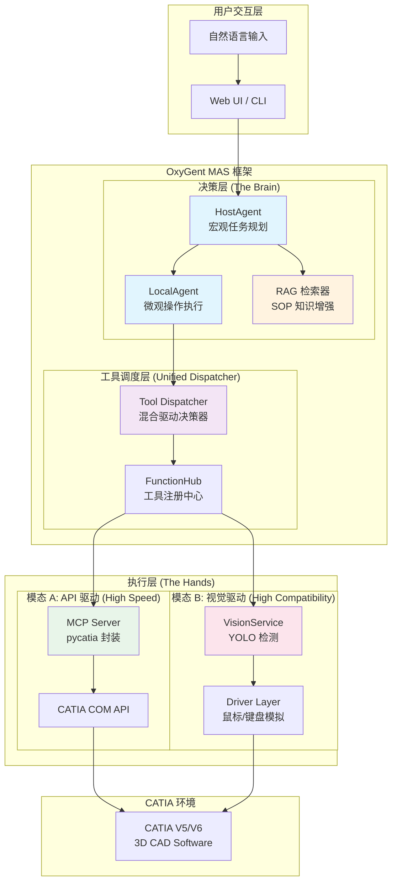
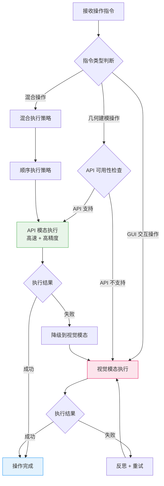

# CATIA VLA-Hybrid 智能体

> **Visual-Language-Action Hybrid Agent for CATIA Automation**  
> 基于 OxyGent 框架的混合驱动 CATIA 自动化建模智能体

[]()
[]()
[]()

---

## ⚡ 30 秒理解本项目

**一句话描述**: 用自然语言控制 CATIA 自动建模

```
输入: "创建一个带加强筋的底座"
       ↓
     LLM 理解意图
       ↓
  ┌────┴────┐
  ↓         ↓
API 模态   视觉模态
(快速精准)  (高兼容)
  ↓         ↓
  └────┬────┘
       ↓
   CATIA 执行
       ↓
输出: 完成的 3D 模型
```

**为什么需要"混合架构"？**
- **API 模态** (pycatia): 毫秒级执行，但只能做标准几何操作
- **视觉模态** (YOLO): 能点击任何按钮，但速度较慢
- **智能切换**: 自动选择最优方式，API 失败时降级到视觉

---

## 📖 项目概述

**CATIA VLA-Hybrid** 是一个智能化的 3D CAD 自动化系统，通过整合三大核心技术：

1. **OxyGent 多智能体框架** - 提供 ReAct 推理、RAG 知识检索、多轮对话能力
2. **YOLO 视觉感知层** - 实现 CATIA GUI 元素的智能识别与定位
3. **pycatia COM API 层** - 提供高速精准的参数化建模能力

实现 **"看-想-做-反思"** 的完整自动化建模闭环。

---

## 🏗️ 系统架构

### 核心架构图



### 混合驱动架构决策树



### 操作模态对照表

| 操作类型 | 模态选择 | 说明 |
|---------|---------|------|
| 创建草图 (Sketch) | 🟢 API | `RectangleBuilder`, `SketchFactory` |
| 拉伸/凸台 (Pad/Extrude) | 🟢 API | `PadBuilder`, `ExtrudeBuilder` |
| 倒角/圆角 (Fillet/Chamfer) | 🟢 API | `FilletBiTangentBuilder` |
| 布尔运算 (Boolean) | 🟢 API | `JoinBuilder`, `SplitBuilder` |
| 参数修改 | 🟢 API | `ParametersService` |
| 点击工具栏图标 | 🔴 视觉 | `click_element()` + YOLO 检测 |
| 处理弹窗/对话框 | 🔴 视觉 | `detect_ui_elements()` |
| 自定义插件/宏 | 🔴 视觉 | 视觉识别 + 鼠标模拟 |
| 文件操作 (保存/打开) | 🟡 混合 | API 优先，失败降级视觉 |

---

## 📁 项目目录结构

```
OxyGent-main/
├── applications/
│   └── catia_vla/                    # CATIA VLA 核心模块
│       ├── agent/                    # 决策层
│       │   ├── host_planner.py       # HostAgent - 宏观任务规划
│       │   ├── local_executor.py     # LocalAgent - 微观操作执行
│       │   ├── llm_client.py         # LLM 客户端封装
│       │   └── prompts/              # Prompt 模板
│       │       ├── host_agent.md
│       │       └── local_agent.md
│       │
│       ├── driver/                   # 驱动层 (视觉模态)
│       │   ├── controller.py         # 鼠标/键盘控制器
│       │   ├── screenshot_tool.py    # 截图工具
│       │   ├── window_manager.py     # 窗口管理器
│       │   └── coordinate_mapper.py  # 坐标映射
│       │
│       ├── perception/               # 感知层 (视觉模态)
│       │   ├── inference.py          # VisionService - YOLO 推理
│       │   ├── weights/              # 模型权重
│       │   └── dataset6/             # 训练数据集
│       │
│       ├── knowledge/                # 知识层
│       │   ├── rag_retriever.py      # RAG 向量检索
│       │   ├── sop_docs/             # SOP 文档库
│       │   └── vector_db/            # 向量数据库
│       │
│       ├── config/                   # 配置文件
│       │   ├── settings.yaml
│       │   └── labels_map.json
│       │
│       ├── main_integrated.py        # 集成入口
│       └── requirements.txt
│
├── applications/
│   └── Catia_Optimzation/            # pycatia API 模块
│       ├── utiles/
│       │   ├── instruction.py        # 几何建模指令类
│       │   ├── sheet_metal.py        # 钣金件生成器
│       │   └── parameters.py         # 参数管理
│       │
│       └── mcp/
│           └── instruction_mcp.py    # MCP Server 封装
│
├── function_hubs/
│   ├── catia_tools.py                # CATIA 视觉工具 FunctionHub
│   └── catia_api_tools.py            # CATIA API 工具 FunctionHub (待创建)
│
├── mcp_servers/
│   └── catia_mcp_server.py           # CATIA MCP Server (待创建)
│
└── oxygent/                          # OxyGent 框架核心
    └── oxy/
        ├── agents/
        │   ├── react_agent.py        # ReAct 智能体
        │   └── rag_agent.py          # RAG 智能体
        ├── function_tools/
        │   └── function_hub.py       # FunctionHub 基类
        └── mcp_tools/
            └── stdio_mcp_client.py   # MCP 客户端
```

---

## 🔧 环境配置

### 系统要求

- **操作系统**: Windows 10/11 (CATIA 仅支持 Windows)
- **Python**: 3.10+
- **CATIA**: V5 R21+ 或 V6
- **GPU**: NVIDIA GPU (可选，用于 YOLO 加速)

### 依赖安装

```bash
# 1. 克隆项目
git clone https://github.com/your-org/OxyGent.git
cd OxyGent-main

# 2. 创建虚拟环境
python -m venv .venv
.venv\Scripts\activate  # Windows

# 3. 安装核心依赖
pip install -r requirements.txt

# 4. 安装 CATIA VLA 依赖
pip install -r applications/catia_vla/requirements.txt

# 5. 安装 pycatia
pip install pycatia

# 6. 安装 YOLO (ultralytics)
pip install ultralytics torch torchvision

# 7. 安装 MCP SDK
pip install mcp
```

### 环境变量配置

创建 `.env` 文件：

```bash
# LLM 配置
DEFAULT_LLM_API_KEY="your_api_key"
DEFAULT_LLM_BASE_URL="https://api.openai.com/v1"
DEFAULT_LLM_MODEL_NAME="gpt-4o"

# CATIA VLA 配置
CATIA_VLA_DEVICE="cuda"  # 或 "cpu"
CATIA_VLA_MODEL_PATH="applications/catia_vla/perception/weights/best.pt"

# 向量数据库配置 (可选)
CHROMA_PERSIST_DIR="./cache_dir/chroma_db"
```

### YOLO 与 pycatia 环境共存方案

由于 YOLO (PyTorch) 和 pycatia (COM) 有不同的依赖环境，推荐以下共存策略：

```python
# 方案1：统一环境 (推荐)
# 在同一 Python 环境中安装所有依赖
# 注意：pycatia 仅在 Windows 上可用

# 方案2：进程隔离
# MCP Server 作为独立进程运行 pycatia
# 主进程运行 YOLO 和 OxyGent
```

---

## 🚀 快速开始

### 1. 验证环境

```python
# test_environment.py
from pycatia import catia
from ultralytics import YOLO
from oxygent import MAS, oxy

print("✅ pycatia:", catia())
print("✅ YOLO:", YOLO("yolov11n.pt"))
print("✅ OxyGent: Ready")
```

### 2. 运行 MVP 示例

```python
# 创建一个简单的立方体
import asyncio
from oxygent import MAS, oxy

oxy_space = [
    oxy.HttpLLM(
        name="default_llm",
        api_key="your_api_key",
        base_url="https://api.openai.com/v1",
        model_name="gpt-4o",
    ),
    oxy.StdioMCPClient(
        name="catia_mcp",
        params={
            "command": "python",
            "args": ["mcp_servers/catia_mcp_server.py"],
        },
    ),
    oxy.ReActAgent(
        name="catia_agent",
        llm_model="default_llm",
        tools=["catia_mcp"],
    ),
]

async def main():
    async with MAS(oxy_space=oxy_space) as mas:
        await mas.start_web_service(
            first_query="创建一个 100x100x100 的立方体"
        )

if __name__ == "__main__":
    asyncio.run(main())
```

### 3. 使用视觉模态

```python
from function_hubs.catia_tools import (
    detect_ui_elements,
    capture_screen,
    click_element,
    activate_catia_window
)

# 1. 激活 CATIA 窗口
activate_catia_window()

# 2. 截图
screenshot = capture_screen()

# 3. 检测 UI 元素
detections = detect_ui_elements(screenshot["file_path"])

# 4. 点击目标元素
for det in detections:
    if det["label"] == "005":  # 假设 005 是"拉伸"图标
        x = (det["bbox"][0] + det["bbox"][2]) // 2
        y = (det["bbox"][1] + det["bbox"][3]) // 2
        click_element(x, y)
        break
```

---

## 📚 核心组件说明

### 1. HostAgent (宏观规划器)

负责将用户的自然语言需求分解为可执行的任务步骤序列。

```python
class HostAgent(ReActAgent):
    """
    职责：
    1. 解析用户意图
    2. 检索相关 SOP 文档
    3. 生成任务步骤列表
    4. 调度 LocalAgent 执行
    """
    
    async def plan_task(self, user_query: str) -> List[TaskStep]:
        # 1. RAG 检索相关 SOP
        sop_context = await self.rag_retriever.search(user_query)
        
        # 2. LLM 生成任务计划
        plan = await self.llm_call(
            prompt=HOST_AGENT_PROMPT,
            context=sop_context,
            query=user_query
        )
        
        return self.parse_plan(plan)
```

### 2. LocalAgent (微观执行器)

负责执行单个任务步骤，自动选择 API 或视觉模态。

```python
class LocalAgent(ReActAgent):
    """
    职责：
    1. 接收单个任务步骤
    2. 判断执行模态 (API/视觉)
    3. 调用相应工具
    4. 验证执行结果
    5. 反思与重试
    """
    
    async def execute_step(self, step: TaskStep) -> ExecutionResult:
        # 1. 模态选择
        modality = self.select_modality(step)
        
        # 2. 执行操作
        if modality == "API":
            result = await self.execute_api(step)
        else:
            result = await self.execute_vision(step)
        
        # 3. 结果验证
        if not result.success:
            # 降级或重试
            result = await self.fallback_execute(step, result)
        
        return result
```

### 3. Unified Dispatcher (统一调度器)

根据操作类型自动路由到正确的执行模态。

```python
class UnifiedDispatcher:
    """
    混合驱动决策逻辑
    """
    
    # API 支持的操作列表
    API_SUPPORTED_OPS = {
        "create_sketch", "create_pad", "create_extrude",
        "create_fillet", "create_chamfer", "boolean_join",
        "boolean_split", "create_plane", "create_point"
    }
    
    def dispatch(self, operation: str) -> str:
        if operation in self.API_SUPPORTED_OPS:
            return "API"
        return "VISION"
```

---

## 🧪 测试

```bash
# 运行单元测试
pytest test/unittest/ -v

# 运行集成测试
pytest test/integration/ -v

# 运行 CATIA VLA 专项测试
python applications/catia_vla/test_integration.py
```

---

## ❓ 常见问题

<details>
<summary><b>Q: CATIA 没有启动，程序会崩溃吗？</b></summary>

不会崩溃。pycatia 会检测 CATIA 状态并返回友好的错误信息，智能体会提示用户 "请先启动 CATIA"。
</details>

<details>
<summary><b>Q: 没有 NVIDIA GPU 能运行吗？</b></summary>

可以。YOLO 会自动检测并回退到 CPU 模式。性能对比：
- GPU (RTX 3060): ~50ms/帧
- CPU (i7-12700): ~500ms/帧
</details>

<details>
<summary><b>Q: 支持哪些 CATIA 版本？</b></summary>

- **已测试**: CATIA V5 R21 ~ R32
- **理论支持**: CATIA V6 (需要适配 COM 接口差异)
</details>

<details>
<summary><b>Q: LLM 必须用 GPT-4 吗？</b></summary>

不必须。推荐配置：
- **最佳效果**: GPT-4o, Claude 3.5 Sonnet
- **性价比**: GPT-4o-mini, DeepSeek V3
- **本地部署**: Qwen2.5-72B (需要足够显存)
</details>

<details>
<summary><b>Q: 视觉模态识别错误怎么办？</b></summary>

1. 确保 CATIA 界面主题为默认主题（深色主题可能影响识别）
2. 检查屏幕分辨率（推荐 1920x1080）
3. 可以通过增加训练数据来微调 YOLO 模型
</details>

---

## 📖 相关文档

- [开发计划 (DEV_PLAN.md)](./DEV_PLAN.md) - 详细的迭代开发任务
- [集成指南 (INTEGRATION_GUIDE.md)](./INTEGRATION_GUIDE.md) - 工具集成说明
- [OxyGent 框架文档](../../docs/docs_zh/) - 框架使用指南
- [pycatia 文档](https://pycatia.readthedocs.io/) - COM API 参考

---

## 🤝 贡献指南

1. Fork 本仓库
2. 创建功能分支 (`git checkout -b feature/amazing-feature`)
3. 提交更改 (`git commit -m 'Add amazing feature'`)
4. 推送分支 (`git push origin feature/amazing-feature`)
5. 创建 Pull Request

---

## 📄 许可证

本项目采用 Apache-2.0 许可证 - 详见 [LICENSE](../../LICENSE) 文件

---

## 🙏 致谢

- [OxyGent](https://github.com/your-org/OxyGent) - 多智能体框架
- [pycatia](https://github.com/evereux/pycatia) - CATIA Python 接口
- [Ultralytics YOLO](https://github.com/ultralytics/ultralytics) - 目标检测框架
- [MCP](https://github.com/anthropics/mcp) - Model Context Protocol

---

*最后更新: 2026-01-08*
